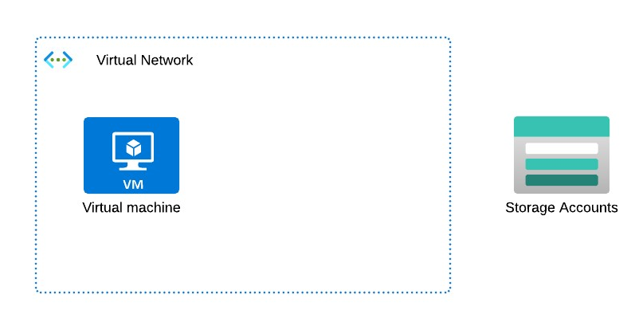
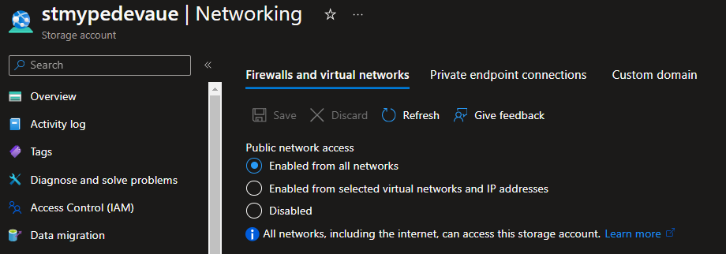
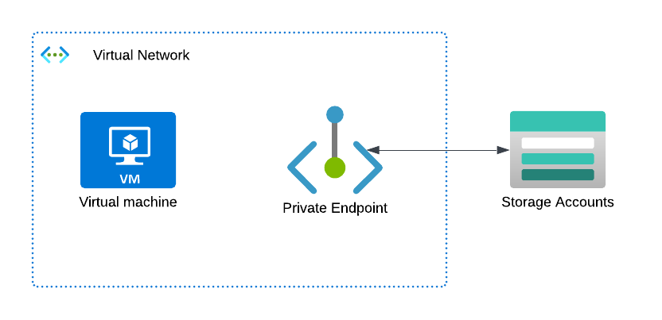
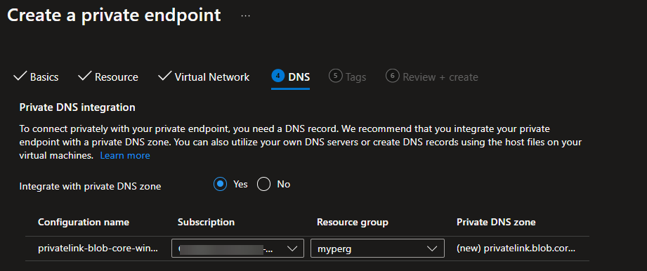
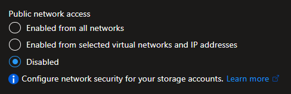

# Azure Private Endpoint

## Service endpoint vs. private endpoint
### Service endpoint
* Enabled access to Azure services over the **public** MS backbone network.
* A service endpoint remains a publicly routable IP address.

### Private endpoint
* Enable access to specific Azure resources over a private IP address.
* Provides granular segmentation.
* Increased isolation by blocking **all** traffic from **public** networks.
* Establishes a **private** and **dedicated** connection within the VNet.

## Without a PE configured

### Overview
A VM was deployed within a VNet along with a storage account having no PE configured. The storage account requires public network access to be enabled to allow the VM to reach it. You could also configure a service endpoint.


Here is the network configuration of the storage account


With the VM deployment, a couple extra resources are provisioned:
1.  Public IP: to allow me to SSH into the machine from the internet, and because this was a quick test, was fine to do so
1. NIC: To connect the VM to the VNet
1. NSG: Tied to the NIC

### Findings
1. Ran the command `nslookup stmypedevaue.blob.core.windows.net` and it yielded the public IP `20.38.113.100` of the Blob service
```
    ->  stmypedevaue.blob.core.windows.net
        canonical name = blob.syd27prdstr01a.store.core.windows.net.
        ttl = 60
    ->  blob.syd27prdstr01a.store.core.windows.net
        internet address = 20.38.113.100
        ttl = 20
```

In the MS public DNS zone, there's a single CNAME record that points to th Blob service's A record having its public IP address configured.

## With a PE configured

### Overview
Same configuration as above, but now the storage account is configured with a private endpoint in the same VNet as the VM.


With the PE deployment, a couple extra resources are provisioned:
1. NIC: Connects the Blob service (this could be any PaaS service) to the VNet.
1. Private DNS Zone (privatelink.blob.core.windows.net): Maps the private link FQDN to the private IP of the NIC above.

### DNS Integration options
* On creating a private endpoint, these 2 options are available
1. Azure private DNS (Integrate with private DNS zone)
1. Custom DNS (to handle DNS resolution by yourself, e.g. your own DNS server or host files on the VM)



### Findings

#### With public network access still enabled
##### Accessed from the internet (outside of the VNet)
1. Running the command `nslookup -debug stmypedevaue.blob.core.windows.net` yields
```
    ->  stmypedevaue.blob.core.windows.net
        canonical name = stmypedevaue.privatelink.blob.core.windows.net
        ttl = 60 (1 min)
    ->  stmypedevaue.privatelink.blob.core.windows.net
        canonical name = blob.syd27prdstr01a.store.core.windows.net
        ttl = 60 (1 min)
    ->  blob.syd27prdstr01a.store.core.windows.net
        internet address = 20.38.113.100
        ttl = 10 (10 secs)
```

In the MS public DNS zone, `stmypedevaue.blob.core.windows.net` is a CNAME now pointing to `stmypedevaue.privatelink.blob.core.windows.net`, but because the private DNS zone isn't accessble from the internet, it resolves it using the MS public DNS zone which has it configured with the public IP of the Blob service (via CNAME and A record resolution).

##### Accessed from within the VNet

1. Running the command `nslookup -debug stmypedevaue.blob.core.windows.net` yields
```
    ->  stmypedevaue.blob.core.windows.net
        canonical name = stmypedevaue.privatelink.blob.core.windows.net.
        ttl = 60
    ->  stmypedevaue.privatelink.blob.core.windows.net
        internet address = 10.0.0.5
        ttl = 9
```

Remember, this resolution is now from **within** the private network. The CNAME record for `stmypedevaue.blob.core.windows.net` (in the MS public DNS zone) now points to the private link child zone `stmypedevaue.privatelink.blob.core.windows.net`. Because the request originated from within the VNet, the private DNS zone is accessible and so the private IP of the private endpoint of the Blob service is resolved.

#### With public network access disabled



1. So now when we run the same command as in the above scenario `nslookup stmypedevaue.blob.core.windows.net`, it yields the private IP `10.0.0.5` of the private endpoint. Notice the resolution to the CNAME `stmypedevaue.privatelink.blob.core.windows.net`
```
    ->  stmypedevaue.blob.core.windows.net
        canonical name = stmypedevaue.privatelink.blob.core.windows.net.
        ttl = 60
    ->  stmypedevaue.privatelink.blob.core.windows.net
        internet address = 10.0.0.5
        ttl = 9
```

Refer to [Accessed from within the VNet](accessed-from-within-the-vnet)

## Glossary

| Acronym | Description | 
| - | - |
| DNS | Domain Name System |
| NIC | Network Interface Card |
| NSG | Network Security Group |
| PaaS | Platform as a service |
| PE | Private Endpoint |
| VNet| Virtual Network |